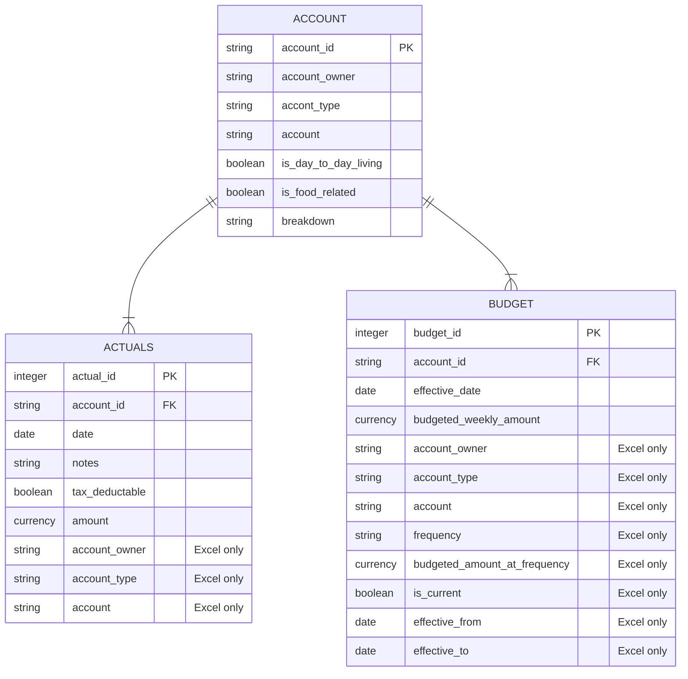

# Household Expenses

This project uses Power BI and Excel Online to create a tracker for household expenditures. Check out the [Excel](#excel) and [Power BI](#power-bi) sections to see how it all came together or dive straight into [Getting Started](#getting-started) to have a go at setting up something for yourself.

At this stage all data entry is manual though if your bank supports it you could certainly look at automating data extraction for transactions.

I used the Microsoft stack for this project as that aligns with my recent work experience and I wanted the opportunity to do more with Power BI. Additionally the Excel Online Cards View for mobile devices seems like a reasonable no code solution for data entry on the go https://support.microsoft.com/en-us/office/use-cards-view-to-work-with-table-data-on-your-phone-fda6099e-2de8-4a52-a926-90a7ee61a32b I did try Microsoft Lists which are currently in preview for personal users but at the time I looked the mobile view was not very friendly and I couldn't work out how to add them as a data source in Power BI.

:warning: **WARNING:** I am not a financial advisor, if at any point while reading these instructions or using these tools you feel you are receiving financial advice you are wrong. You are not receiving financial advice and should reconsider how you interact with content from unvetted sources.

- [Getting Started](#getting-started)
    - [Prerequisites](#prerequisites)
    - [Initial Setup](#initial-setup)
    - [Data Entry](#data-entry)
    - [Analysis](#analysis)
    - [Data Model](#data-model)
    - [Examples](#examples)
- [Excel](#excel)
    - [References](#references)
    - [Account](#account)
    - [Budget](#budget)
    - [Actuals](#actuals)
    - [Bulk](#bulk)
- [Power BI](#power-bI)
    - [Load Data](#load-data)
        - [Date Table](#date-table)
    - [Relationships](#relationships)
    - [Measures](#measures)
    - [Visuals](#visuals)
    - [Mobile App](#mobile-app)
    - [Publishing](#publishing)

## Getting Started

### Prerequisites

To re-create or make use of this project you will need the following:

- Microsoft Account
    - required for Excel Online and OneDrive
    - available free of charge: https://account.microsoft.com/account/Account
- Power BI Desktop
    - required for initial report creation and some actions when expanding the report (e.g. new measures)
    - if you don't sign up to the Power BI service you will also need Power BI Dekstop to refresh and view the report
    - available free of charge: https://powerbi.microsoft.com/en-us/desktop/

If you want to have the report refresh automatically or be available online (e.g. for sharing or to access via your mobile phone) you will also need to sign up to the Power BI service. This can be done free of charge as per: https://learn.microsoft.com/en-us/power-bi/enterprise/service-admin-signing-up-for-power-bi-with-a-new-office-365-trial

You may also want to use the Microsoft Office mobile app for easy data entry via a mobile device and the Power BI mobile app to access your report via your mobile device.

### Initial Setup

The first thing that we are going to do is configure copies of the Excel and Power BI files so that they can be used together.

1. Make sure you have read the above section and have the prerequisites sorted.
2. Download the sample Excel and Power BI Files.
    - [Example Household Expenses.xlsx](Example%20Household%20Expenses.xlsx)
    - [Example Household Expenses.pbix](Example%20Household%20Expenses.pbix)
3. Give the Excel file a meaningful name and save it into your personal OneDrive account.
4. Generate an embed link for the Excel file, we'll need this to load the data into Power BI.
    - browse to the OneDrive folder that the Excel file is saved within
    - select the file but don't open it
    - click on *Embed* from the menu along the top
    - copy the embed code into a text editor (e.g. Notepad++)
    - from the URL inside the embed code retrieve the: resid; cid and; authkey, these values com after embed? and are seperated by '&'s
    - e.g. if you had the below embed code you would end up with:
        - cid = 4F9CE0027445F3F9
        - resid = 4F9CE0027445F3F9%21704043
        - authkey = ALtMpI-9vXWqOxc

```html
<iframe src="https://onedrive.live.com/embed?cid=4F9CE0027445F3F9&resid=4F9CE0027445F3F9%21704043&authkey=ALtMpI-9vXWqOxc&em=2" width="402" height="346" frameborder="0" scrolling="no"></iframe>
```

5. Open the Power BI file and select *Transform Data* .
6. Within the Excel URL folder enter the values that you recorded in step 4 into their corresponding parameters.
7. Try *Refresh Preview* > *Refresh All* to check the connection to the Excel workbook, if prompted to login select **Anonymous**.
    - if things haven't worked out go back to step 4 and double check you have the correct values for the: resid; cid and; authkey
8. Press *Close & Apply* to apply the changes that you have made.
9. Save your Power BI file with a meaningful name.

You should now have connectivity between your versions of the Excel and Power BI files. If you have signed up for the Power BI service you can now press *Publish* and follow the prompts to login to upload your report to the Power BI service.

### Data Entry

As with all things you only get out what you put in

### Analysis


### Data Model

Simple is the name of the game with the data model.

- Accounts are created to describe transactions.
- Budgets are set for each account at an arbitrary frequency and converted to weekly amounts for reporting.
- Actuals are tracked by associated a cost to an account on a date.

There are some fields that are denormalized in Excel or only exist in Excel to support data entry.

Budgets are set in Excel based on date ranges, when they are loaded into Power BI they are exploded into one record per week that the budget period is effective.

For detailed explanations of how each entity works please see their associated Excel sections.



## Excel Setup

Excel is a rightly contentious topic in the data community. We are going to use it for the same reason that it is (mis)used around the world every day, it is quick and easy to get started. We will however apply some discipline to how we use Excel to ensure that it is as clean and manageable as possible by using tables and simple data validation rules.

If you ever find yourself writing a formula in Excel that references cells directly (e.g. =IF(A2=$E$2, B2, C2)) then you have made a mistake and should see if you can re-work your structure to use tables (or in the Desktop version named ranges).

This project uses the following Excel features:

- Tables: https://support.microsoft.com/en-us/office/overview-of-excel-tables-7ab0bb7d-3a9e-4b56-a3c9-6c94334e492c
- XLOOKUP: https://support.microsoft.com/en-us/office/xlookup-function-b7fd680e-6d10-43e6-84f9-88eae8bf5929
- Data Validation: https://support.microsoft.com/en-us/office/apply-data-validation-to-cells-29fecbcc-d1b9-42c1-9d76-eff3ce5f7249#ID0EDBF=Web
    - INDIRECT can be used as an alternative to named ranges for defining pick lists e.g. `=INDIRECT("DayOfWeek[Day of Week]")`
    - https://support.microsoft.com/en-us/office/indirect-function-474b3a3a-8a26-4f44-b491-92b6306fa261

I have used an Excel Online workbook saved into a Personal OneDrive folder for this project.

### References

The References worksheet contains the following 'helper' tables used in other parts of the workbook.

#### DateRange

- Used by Power BI to determine the bounds of the data table, it is based on the first and last effective dates from the Budget table.
- The formulae to get the first and last transaction dates reference the Actuals table name rather than specific cells, i.e. we do
    - `=MIN(Budget[Effective From])` and `=MAX(Budget[Effective To])` instead of something like
    - `=MIN(Budget!I:I)` and `=MAX(Budget!J:J)`

#### DatePicker

- Used for the data validation pick list in the Actuals table, a workaround for not being able to default new entries to today's date.

#### BudgetedFrequency

- Used in the Budget table to convert human friendly frequency names into divisors used to generate the appropriate weekly amount.
- This means that our formula for budgeted weekly amounts can be simplified and easier to manage (i.e. new frequencies get added to a lookup table not a formula).
    - `=[@[Budgeted Amount at Frequency]] / XLOOKUP([@Frequency], BudgetedFrequency[Budgeted Frequency], BudgetedFrequency[Divisor For Weekly Amount])` instead of
    - `=[@[Budgeted Amount at Frequency]] / SWITCH([@Frequency], "Weekly", 1, "Fortnightly", 2, "Monthly", 4.33, "Quarterly", 13, "Half-Yearly", 26, "Annually", 52)`

#### DayOfWeek

- Used as a data validation pick list in the Bulk spreadsheet to simplify data entry.

### Account

The Account table must be setup and populated before you can start populating the Budget and Actuals tables as they both link back to it on `Account ID`.

You should take time to consider populating this table carefully as it will determine at what level you want to break down your analysis. Personally I opted to go for what feels like a mix of levels depending on the type of expense, for example:

- a single account for groceries rather than breaking this down further (e.g. into fruit and vegetables, dry goods etc)
- separate accounts for each streaming service we subscribed to rather than a single account for all streaming services


The Account table contains the following fields used to describe and group accounts:

- Account ID
    - Combination of Account Owner and Account to make data entry simpler.
    - `=LEFT([@[Account Owner]], 3) & "-" & [@Account]`.
- Account Owner
    - Used to tie an account back to a particular person, something I used as my wife and I tend to keep our personal finances separate.
    - If you don't want to Account Owner and aren't comfortable with Power BI yet you may find it simplest to set use the same value for all entries.
- Account Type
    - Categorical grouping for accounts, e.g. Entertainment or Health.
- Is Day to Day Living
    - Either *TRUE* or *FALSE*, used as a quick filter in visualiations where you don't want irregular or fixed costs influencing the analysis.
- Is Food Related
    - Either *TRUE* or *FALSE*, similiar to the above used as a quick filter because this is something in particular that I wanted to track.
- Breakdown
    - As Is Food Related was generally a subset of Is Day to Day Living this represented a convenient way of creating a high level group for accounts based on these flags.
    - `=IF([@[Is Food Related]], "Food", IF([@[Is Day to Day Living]], "Day to Day", "Other"))`

### Budget

The Budget table is used to apply a budgeted amount against each account. Changes to budgeted amounts can be recorded over time by using the Effective From and Effective To date fields.

There are no smarts on this page to ensure accurate data entry, you'll need to do that yourself e.g. make sure that:

- Every account has a budgeted amount.
- Effective From and Effective To dates don't overlap for the same account.

The Budget table contains the following fields used to record budgeted amounts per account:

- Account ID
    - Links back to Account[Account ID].
    - Data Validation: `=INDIRECT("Account[Account ID]")`
- Account Owner
    - Lookup to Account via Budget[Account ID] to make data entry easier.
    - `=XLOOKUP([@[Account ID]], Account[Account ID], Account[Account Owner])`
- Account Type
    - Lookup to Account via Budget[Account ID] to make data entry easier.
    - `=XLOOKUP([@[Account ID]], Account[Account ID], Account[Account Type])`
- Account
    - Lookup to Account via Budget[Account ID] to make data entry easier.
    - `=XLOOKUP([@[Account ID]], Account[Account ID], Account[Account])`
- Frequency
    - Used to convert budgeted amounts from a frequency that makes sense for that account to a weekly amount.
    - Data Validation: `=INDIRECT("BudgetedFrequency[Budgeted Frequency]")`
- Budgeted Amount at Frequency
    - Budgeted amount for the account at the indicated frequency.
- Budgeted Weekly Amount
    - Budgeted amount for the account at a weekly interval to standardise reporting.
    - `=[@[Budgeted Amount at Frequency]] / XLOOKUP([@Frequency], BudgetedFrequency[Budgeted Frequency], BudgetedFrequency[Divisor For Weekly Amount])`
- Is Current
    - TRUE/FALSE flag to indicate if this row represents the latest/current budget information for the account.
    - No smarts here, up to you to make sure the data entry is accurate.
    - Data Validation: `=INDIRECT("TrueFalse[True False]")`
- Effective From
    - Date that the budget information is valid from.
    - No smarts here, up to you to make sure the data entry is accurate.
- Effective To
    - Date that the budget informatio is valid to.
    - No smarts here, up to you to make sure the data entry is accurate.

### Actuals

The Actuals table is used to track all expenses against their associated accounts.

No smarts on this page but you could see if your bank has an API to let you bring transactions down automatically or somewhat automated via manual exports. Personally I just record all expenses as they come up and it never becomes too big of a job.

:memo: **Note** if you are doing data entry via a mobile device you should try the Microsoft Office App so that you can use the Excel Table Cards view.

The Actuals table contains the following fields used to record actual expenses per account:

- Account ID
    - Links back to Account[Account ID].
    - Data Validation: `=INDIRECT("Account[Account ID]")`
- Amount
    - The cost of the expense.
- Date
    - I use the date that the expense was paid rather than incurred though up to you as long as you are consistent.
    - Data Validation: `=INDIRECT("Date[Date]")`
- Account Type
    - Lookup to Account via Budget[Account ID] to make data entry easier.
    - `=XLOOKUP([@[Account ID]], Account[Account ID], Account[Account Type])`
- Account Owner
    - Lookup to Account via Budget[Account ID] to make data entry easier.
    - `=XLOOKUP([@[Account ID]], Account[Account ID], Account[Account Owner])`
- Notes
    - Any additional details that you want to record against the expense.
    - Will end up in a word cloud on the report, also handy for deep dives into where your money has been going.
- Tax Deductable
    - TRUE/FALSE flag to indicate if this row represents a tax deductable transaction, hopefully makes tax time a bit easier.
    - Data Validation: `=INDIRECT("TrueFalse[True False]")`

### Bulk

The Bulk page is used to semi-automate bulk data entry. I've used it for fixed regular expenses e.g.:

- mortage payments
- streaming subscriptions
- utilities

Check the page itself for instructions on how to use it.

## Power BI

I've used Power BI because I am familiar with it via work and wanted an opportunity to a do a little more with it. Also Power BI is easily accessible for most folks and has been used at all of my recent organisations. I should probably have a go at rebuilding it in Tableau and Looker as well to get some experience with these tools.

If you haven't used Power BI before Microsoft have some pretty decent guides available to get you started https://powerbi.microsoft.com/en-us/getting-started-with-power-bi/

### Load Data

First step in creating any report is to lay your hands on some data, hopefully we have done an okay job on the Excel side of things.


#### Date Table

### Relationships

### Measures

### Visuals

#### Summary

##### TT - by Account

#### Highlights

#### Account Details

#### Trends

### Mobile App

### Publishing
