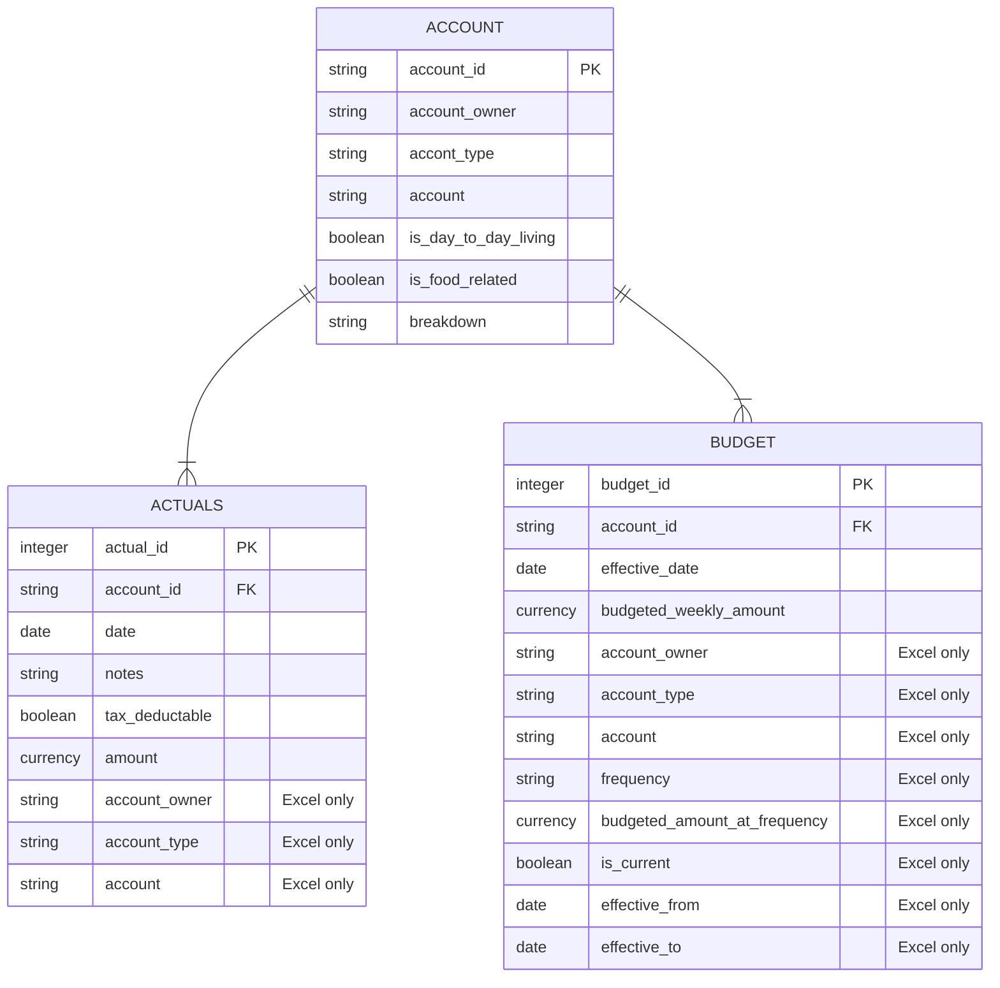

# Household Expenses

This project uses Power BI and Excel Online to create a tracker for household expenditures. See how it works below or jump straight to the downloads and examples to get started.

At this stage all data entry is manual though if your bank supports it you could certainly look at automating data extraction for transactions.

I used the Microsoft stack for this project as that aligns with my recent work experience and I wanted the opportunity to do more with Power BI. Additionally the Excel Online Cards View for mobile devices seems like a reasonable no code solution for data entry on the go https://support.microsoft.com/en-us/office/use-cards-view-to-work-with-table-data-on-your-phone-fda6099e-2de8-4a52-a926-90a7ee61a32b I did try Microsoft Lists which are currently in preview for personal users but at the time I looked the mobile view was not very friendly and I couldn't work out how to add them as a data source in Power BI.

:warning: **WARNING:** I am not a financial advisor, if at any point while reading these instructions or using these tools you feel you are receiving financial advice you are wrong. You are not receiving financial advice and should reconsider how you interact with content from unvetted sources.

- [Prerequisites](#prerequisites)
- [Data Model](#data-model)
- [Downloads](#downloads)
- [Excel Setup](#excel-setup)
    - [References](#references)
    - [Account](#account)
    - [Budget](#budget)
    - [Actuals](#actuals)
    - [Bulk](#bulk)
- [Power BI](#power-bI)
    - [Load Data](#load-data)
        - [Date Table](#date-table)
    - [Relationships](#relationships)
    - [Measures](#measures)
    - [Visuals](#visuals)
    - [Mobile App](#mobile-app)
    - [Publishing](#publishing)
- [Usage](#usage)
    - [Data Entry](#data-entry)
    - [Analysis](#analysis)

## Prerequisites

To re-create or make use of this project you will need the following:

- Microsoft Account
    - required for Excel Online and OneDrive
    - available free of charge: https://account.microsoft.com/account/Account
- Power BI Desktop
    - required for initial report creation and some actions when expanding the report (e.g. new measures)
    - if you don't sign up to the Power BI service you will also need Power BI Dekstop to refresh and view the report
    - available free of charge: https://powerbi.microsoft.com/en-us/desktop/

If you want to have the report refresh automatically or be available online (e.g. for sharing or to access via your mobile phone) you will also need to sign up to the Power BI service. This can be done free of charge as per: https://learn.microsoft.com/en-us/power-bi/enterprise/service-admin-signing-up-for-power-bi-with-a-new-office-365-trial

You may also want to use the Microsoft Office mobile app for easy data entry via a mobile device and the Power BI mobile app to access your report via your mobile device.

## Data Model

Simple is the name of the game with the data model.

- Accounts are created to describe transactions.
- Budgets are set for each account at an arbitrary frequency and converted to weekly amounts for reporting.
- Actuals are tracked by associated a cost to an account on a date.

There are some fields that are denormalized in Excel or only exist in Excel to support data entry.

Budgets are set in Excel based on date ranges, when they are loaded into Power BI they are exploded into one record per week that the budget period is effective.

For detailed explanations of how each entity works please see their associated Excel sections.

## Downloads

These files use an example dataset very loosely inspired by Sir Sam and Lady Sybil Vimes of Anhk-Morpork with transactions for January and February 2023.

- [Power BI Desktop File]
- [Excel Spreadsheet]

## Excel Setup

Excel is a rightly contentious topic in the data community. We are going to use it for the same reason that it is (mis)used around the world every day, it is quick and easy to get started. We will however apply some discipline to how we use Excel to ensure that it is as clean and manageable as possible by using tables and simple data validation rules.

If you ever find yourself writing a formula in Excel that references cells directly (e.g. =IF(A2=$E$2, B2, C2)) then you have made a mistake and should see if you can re-work your structure to use tables (or in the Desktop version named ranges).

This project uses Excel tables and the XLOOKUP function, if you aren't familiar with these the following Microsoft guides will get you started:

- Excel tables: https://support.microsoft.com/en-us/office/overview-of-excel-tables-7ab0bb7d-3a9e-4b56-a3c9-6c94334e492c
- XLOOKUP: https://support.microsoft.com/en-us/office/xlookup-function-b7fd680e-6d10-43e6-84f9-88eae8bf5929

### References

The References worksheet contains the following 'helper' tables used in other parts of the workbook.

#### DateRange

- Used by Power BI to determine the bounds of the data table, it is based on the first and last effective dates from the Budget table.
- The formulae to get the first and last transaction dates reference the Actuals table name rather than specific cells, i.e. we do
    - `=MIN(Budget[Effective From])` and `=MAX(Budget[Effective To])` instead of something like
    - `=MIN(Budget!I:I)` and `=MAX(Budget!J:J)`

#### DatePicker

- Used for the data validation pick list in the Actuals table, a workaround for not being able to default new entries to today's date.

#### BudgetedFrequency

- Used in the Budget table to convert human friendly frequency names into divisors used to generate the appropriate weekly amount.
- This means that our formula for budgeted weekly amounts can be simplified and easier to manage (i.e. new frequencies get added to a lookup table not a formula).
    - `=[@[Budgeted Amount at Frequency]] / XLOOKUP([@Frequency], BudgetedFrequency[Budgeted Frequency], BudgetedFrequency[Divisor For Weekly Amount])` instead of
    - `=[@[Budgeted Amount at Frequency]] / SWITCH([@Frequency], "Weekly", 1, "Fortnightly", 2, "Monthly", 4.33, "Quarterly", 13, "Half-Yearly", 26, "Annually", 52)`

#### DayOfWeek

- Used as a data validation pick list in the Bulk spreadsheet to simplify data entry.

### Account

This table must be setup and populated before you can start populating the budget and actuals tables as they both link back to it on `Account ID`.

You should take time to consider populating this table carefully as it will determine at what level you want to break down your analysis. Personally I opted to go for what feels like a mix of levels depenidng on the type of expense, for example:

- a single account for groceries rather than breaking this down further (e.g. into meat, fruit and vegetables etc)
- seperate accounts for each streaming service we subscribed to rather than a single account for all streaming services

It contains the following fields used to describe and group accounts:

- Account ID
    - Combination of Account Owner and Account to make data entry simpler.
    - `=LEFT([@[Account Owner]], 3) & "-" & [@Account]`.
- Account Owner
    - Used to tie an account back to a particular person, something I used as my wife and I tend to keep our personal finances separate.
    - If you don't want to Account Owner and aren't comfortable with Power BI yet you may find it simplest to set use the same value for all entries.
- Account Type
    - Categorical grouping for accounts, e.g. Entertainment or Health.
- Is Day to Day Living
    - Either *TRUE* or *FALSE*, used as a quick filter in visualiations where you don't want irregular or fixed costs influencing the analysis.
- Is Food Related
    - Either *TRUE* or *FALSE*, similiar to the above used as a quick filter because this is something in particular that I wanted to track.
- Breakdown
    - As Is Food Related was generally a subset of Is Day to Day Living this represented a convenient way of creating a high level group for accounts based on these flags.
    - `=IF([@[Is Food Related]], "Food", IF([@[Is Day to Day Living]], "Day to Day", "Other"))`

### Budget

### Actuals

### Bulk

## Power BI

### Load Data

#### Date Table

### Relationships

### Measures

### Visuals

#### Summary

##### TT - by Account

#### Highlights

#### Account Details

#### Trends
### Mobile App

### Publishing

## Usage

As with all things you only get out what you put in

### Data Entry

### Analysis
