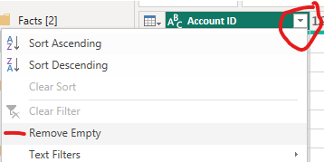
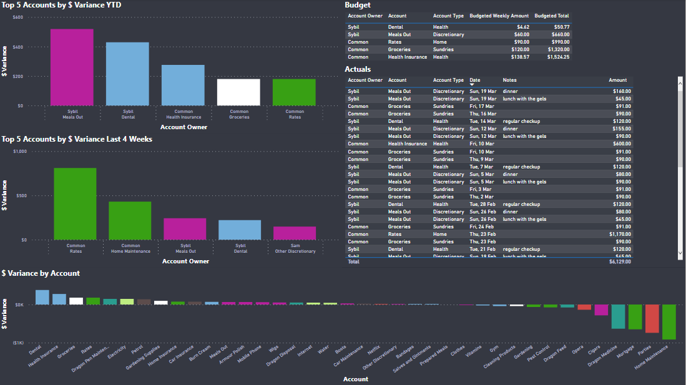

# Household Expenses

This project started because I wanted to better understand of how I was spending my money so that I could identify opportunities to be smarter with savings and start actively working towards some sort of early retirement plan. I felt like I already had a pretty good idea of how things were going but as we know gut feel is not often a good substitute for hard data. Initial plan was to just keep a list of costs for a few months and then dive into them in an exploratory and ad-hoc manner however I decided that this would be a good opportunity to get hands on with Power BI again as my current role is more focussed on data engineering than reporting and I was feeling a little rusty.

This project uses Power BI and Excel Online to create a tracker for household expenditures.


The Power BI screenshots in this guide are from an example copy of the report which is using the *More Dark Mode* theme from *Numerro* with some minor tweaks https://community.powerbi.com/t5/Themes-Gallery/Showcasing-Themes-More-Dark-Mode/td-p/1987778

- take a gander at an [example report](https://app.powerbi.com/view?r=eyJrIjoiZDIzMTg0MjAtOGQwOS00N2U5LWJmNmItYjVhNjgwYzM1YzU5IiwidCI6IjY1NDI1YWQ4LTFjY2UtNDgwMC1iNjZjLWYyZTQzNWI3NjEyZiJ9&pageName=ReportSection)
    - right click on the link and open in a new tab/window
    - filter pane is unavailable in this view
- check out [Getting Started](#getting-started) to have a go at setting up something similar for yourself
- dive into the [Excel](#excel) and [Power BI](#power-bi) sections to see how it all came together

At this stage all data entry is manual though if your bank supports it you could certainly look at automating data extraction for transactions.

I used the Microsoft stack for this project as that aligns with my recent work experience and I wanted the opportunity to do more with Power BI. Additionally the Excel Online Cards View for mobile devices seems like a reasonable no code solution for data entry on the go https://support.microsoft.com/en-us/office/use-cards-view-to-work-with-table-data-on-your-phone-fda6099e-2de8-4a52-a926-90a7ee61a32b I did try Microsoft Lists which are currently in preview for personal users but at the time I looked the mobile view was not very friendly and I couldn't work out how to add them as a data source in Power BI.

:warning: **WARNING:** I am not a financial advisor, if at any point while reading these instructions or using these tools you feel you are receiving financial advice you are wrong. You are not receiving financial advice and should reconsider how you interact with content from unvetted sources.

- [Getting Started](#getting-started)
    - [Prerequisites](#prerequisites)
    - [Initial Setup](#initial-setup)
    - [Data Entry](#data-entry)
    - [Data Refresh](#data-refresh)
    - [Analysis](#analysis)
    - [Data Model](#data-model)
    - [Examples](#examples)
- [Excel](#excel)
    - [References](#references)
    - [Account](#account)
    - [Budget](#budget)
    - [Actuals](#actuals)
    - [Bulk](#bulk)
- [Power BI](#power-bI)
    - [Load Data](#load-data)
        - [Parameters](#parameters)
        - [Data Tables](#data-tables)
        - [Date Table](#date-table)
        - [Tidy Up](#tidy-up)
    - [Data Modelling](#data-modelling)
        - [Relationships](#relationships)
        - [Key Columns](#key-columns)
        - [Display Folders](#display-folders)
        - [Default Aggregations](#default-aggregations)
        - [Formats and Sorts](#formats-and-sorts)
    - [Measures](#measures)
    - [Report Filters](#report-filters)
    - [Visuals](#visuals)
    - [Mobile App](#mobile-app)

## Getting Started

### Prerequisites

To re-create or make use of this project you will need the following:

- Microsoft Account
    - required for Excel Online and OneDrive
    - available free of charge: https://account.microsoft.com/account/Account
- Power BI Desktop
    - required for initial report creation and some actions when expanding the report (e.g. new measures)
    - if you don't sign up to the Power BI service you will also need Power BI Dekstop to refresh and view the report
    - available free of charge: https://powerbi.microsoft.com/en-us/desktop/

If you want to have the report refresh automatically or be available online (e.g. for sharing or to access via your mobile phone) you will also need to sign up to the Power BI service. This can be done free of charge as per: https://learn.microsoft.com/en-us/power-bi/enterprise/service-admin-signing-up-for-power-bi-with-a-new-office-365-trial

You may also want to use the Microsoft Office mobile app for easy data entry via a mobile device and the Power BI mobile app to access your report via your mobile device.

### Initial Setup

The first thing that we are going to do is configure copies of the Excel and Power BI files so that they can be used together.

1. Make sure you have read the above section and have the prerequisites sorted.
2. Download the sample Excel and Power BI Files.
    - [Example Household Expenses.xlsx](Example%20Household%20Expenses.xlsx)
    - [Example Household Expenses.pbix](Example%20Household%20Expenses.pbix)
3. Give the Excel file a meaningful name and save it into your personal OneDrive account.
4. Generate an embed link for the Excel file, we'll need this to load the data into Power BI.
    - browse to the OneDrive folder that the Excel file is saved within
    - select the file but don't open it
    - click on *Embed* from the menu along the top
    - copy the embed code into a text editor (e.g. Notepad++)
    - from the URL inside the embed code retrieve the: resid; cid and; authkey, these values com after embed? and are seperated by '&'s
    - e.g. if you had the below embed code you would end up with:
        - cid = 4F9CE0027445F3F9
        - resid = 4F9CE0027445F3F9%21704043
        - authkey = ALtMpI-9vXWqOxc
    ```html
    <iframe src="https://onedrive.live.com/embed?cid=4F9CE0027445F3F9&resid=4F9CE0027445F3F9%21704043&authkey=ALtMpI-9vXWqOxc&em=2" width="402" height="346" frameborder="0" scrolling="no"></iframe>
    ```
5. Open the Power BI file and select *Transform Data > Edit Parameters*.
6. Enter the values that you recorded in step 4 into their corresponding parameters.
    - leave excel_url_base as it is
    - 
7. Try the *Refresh* button to check the connection to the Excel workbook, if prompted to login select **Anonymous**.
    - if things haven't worked out go back to step 4 and double check you have the correct values for the: resid; cid and; authkey
8. Press *Close & Apply* to apply the changes that you have made.
9. Save your Power BI file with a meaningful name.

You should now have connectivity between your versions of the Excel and Power BI files. If you have signed up for the Power BI service you can now press *Publish* and follow the prompts to login to upload your report to the Power BI service.

### Data Entry

As with all things you only get out what you put in. Initial data entry requires populating the [Account](#account) and [Budget](#budget) tables, the [Excel Setup](#excel-setup) instructions for these tables provides some guidance on populating them.

- [Account](#account)
- [Budget](#budget)

Once you have populated the [Account](#account) and [Budget](#budget) tables it is time to start populating the [Actuals](#actuals) tables. You can use the [Bulk](#bulk) worksheet to do initial data entry of regular expenses but after that it is time for manual data entry.

I personally find it pretty quick and easy to use Excel Table Cards view on my mobile phone to record expenses as they occur:

- https://support.microsoft.com/en-us/office/use-cards-view-to-work-with-table-data-on-your-phone-fda6099e-2de8-4a52-a926-90a7ee61a32b

    

### Data Refresh

You can use the *Refresh* button in Power BI desktop to manually refresh your report or if you have signed up for the Power BI service you can publish your report and then setup a scheduled refresh:
- publish - https://learn.microsoft.com/en-us/power-bi/create-reports/desktop-upload-desktop-files
- schedule - https://learn.microsoft.com/en-us/power-bi/connect-data/refresh-scheduled-refresh

### Analysis

While the visualisations I have created so far are hopefully a good start they have been tailored to where I want to take my personal analysis at time of writing, delete anything that doesn't make sense and create what works for you.

Each page that I have created is geared towards a specific purpose:

- Summary - generally filtered to `[Is Day to Day Living] = TRUE` to provide a quick overview of how the more variable expenses are tracking in recent weeks

    

- Highlights - used to identify any accounts that are trending significantly above what I expected/had vague plans for

    

- Account Details - drill into a specific account or group of accounts

    

- Trends - get a general high level overview of how actuals are tracking

    

If you are still getting started with Power BI I would encourage you to read through the [Power BI](#power-bi) section to see how the existing visualisations have been created and maybe spark some ideas for changing them or even creating new ones to suit your particular requirements.

### Data Model

Simple is the name of the game with the data model.

- Accounts are created to describe transactions.
- Budgets are set for each account at an arbitrary frequency and converted to weekly amounts for reporting.
- Actuals are tracked by associated a cost to an account on a date.

There are some fields that are denormalized in Excel or only exist in Excel to support data entry.

Budgets are set in Excel based on date ranges, when they are loaded into Power BI they are exploded into one record per week that the budget period is effective.

For detailed explanations of how each entity works please see their associated Excel sections.


---

## Excel Setup

Excel is a rightly contentious topic in the data community. We are going to use it for the same reason that it is (mis)used around the world every day, it is quick and easy to get started. We will however apply some discipline to how we use Excel to ensure that it is as clean and manageable as possible by using tables and simple data validation rules.

If you ever find yourself writing a formula in Excel that references cells directly (e.g. =IF(A2=$E$2, B2, C2)) then you have made a mistake and should see if you can re-work your structure to use tables (or in the Desktop version named ranges).

This project uses the following Excel features:

- Tables: https://support.microsoft.com/en-us/office/overview-of-excel-tables-7ab0bb7d-3a9e-4b56-a3c9-6c94334e492c
- XLOOKUP: https://support.microsoft.com/en-us/office/xlookup-function-b7fd680e-6d10-43e6-84f9-88eae8bf5929
- Data Validation: https://support.microsoft.com/en-us/office/apply-data-validation-to-cells-29fecbcc-d1b9-42c1-9d76-eff3ce5f7249#ID0EDBF=Web
    - INDIRECT can be used as an alternative to named ranges for defining pick lists e.g. `=INDIRECT("DayOfWeek[Day of Week]")`
    - https://support.microsoft.com/en-us/office/indirect-function-474b3a3a-8a26-4f44-b491-92b6306fa261

I have used an Excel Online workbook saved into a Personal OneDrive folder for this project.

### References

The References worksheet contains the following 'helper' tables used in other parts of the workbook.

#### DateRange

- Used by Power BI to determine the bounds of the data table, it is based on the first and last effective dates from the Budget table.
- The formulae to get the first and last transaction dates reference the Actuals table name rather than specific cells, i.e. we do
    - `=MIN(Budget[Effective From])` and `=MAX(Budget[Effective To])` instead of something like
    - `=MIN(Budget!I:I)` and `=MAX(Budget!J:J)`

#### DatePicker

- Used for the data validation pick list in the Actuals table, a workaround for not being able to default new entries to today's date.

#### BudgetedFrequency

- Used in the Budget table to convert human friendly frequency names into divisors used to generate the appropriate weekly amount.
- This means that our formula for budgeted weekly amounts can be simplified and easier to manage (i.e. new frequencies get added to a lookup table not a formula).
    - `=[@[Budgeted Amount at Frequency]] / XLOOKUP([@Frequency], BudgetedFrequency[Budgeted Frequency], BudgetedFrequency[Divisor For Weekly Amount])` instead of
    - `=[@[Budgeted Amount at Frequency]] / SWITCH([@Frequency], "Weekly", 1, "Fortnightly", 2, "Monthly", 4.33, "Quarterly", 13, "Half-Yearly", 26, "Annually", 52)`

#### DayOfWeek

- Used as a data validation pick list in the Bulk spreadsheet to simplify data entry.


### Account

The Account table must be setup and populated before you can start populating the Budget and Actuals tables as they both link back to it on `Account ID`.

You should take time to consider populating this table carefully as it will determine at what level you want to break down your analysis. Personally I opted to go for what feels like a mix of levels depending on the type of expense, for example:

- a single account for groceries rather than breaking this down further (e.g. into fruit and vegetables, dry goods etc)
- separate accounts for each streaming service we subscribed to rather than a single account for all streaming services

The Account table contains the following fields used to describe and group accounts:

- Account ID
    - Combination of Account Owner and Account to make data entry simpler.
    - `=LEFT([@[Account Owner]], 3) & "-" & [@Account]`.
- Account Owner
    - Used to tie an account back to a particular person, something I used as my wife and I tend to keep our personal finances separate.
    - If you don't want to Account Owner and aren't comfortable with Power BI yet you may find it simplest to set use the same value for all entries.
- Account Type
    - Categorical grouping for accounts, e.g. Entertainment or Health.
- Is Day to Day Living
    - Either *TRUE* or *FALSE*, used as a quick filter in visualiations where you don't want irregular or fixed costs influencing the analysis.
- Is Food Related
    - Either *TRUE* or *FALSE*, similiar to the above used as a quick filter because this is something in particular that I wanted to track.
- Breakdown
    - As Is Food Related was generally a subset of Is Day to Day Living this represented a convenient way of creating a high level group for accounts based on these flags.
    - `=IF([@[Is Food Related]], "Food", IF([@[Is Day to Day Living]], "Day to Day", "Other"))`


### Budget

The Budget table is used to apply a budgeted amount against each account. Changes to budgeted amounts can be recorded over time by using the Effective From and Effective To date fields.

There are no smarts on this page to ensure accurate data entry, you'll need to do that yourself e.g. make sure that:

- Every account has a budgeted amount.
- Effective From and Effective To dates don't overlap for the same account.

The Budget table contains the following fields used to record budgeted amounts per account:

- Account ID
    - Links back to Account[Account ID].
    - Data Validation: `=INDIRECT("Account[Account ID]")`
- Account Owner
    - Lookup to Account via Budget[Account ID] to make data entry easier.
    - `=XLOOKUP([@[Account ID]], Account[Account ID], Account[Account Owner])`
- Account Type
    - Lookup to Account via Budget[Account ID] to make data entry easier.
    - `=XLOOKUP([@[Account ID]], Account[Account ID], Account[Account Type])`
- Account
    - Lookup to Account via Budget[Account ID] to make data entry easier.
    - `=XLOOKUP([@[Account ID]], Account[Account ID], Account[Account])`
- Frequency
    - Used to convert budgeted amounts from a frequency that makes sense for that account to a weekly amount.
    - Data Validation: `=INDIRECT("BudgetedFrequency[Budgeted Frequency]")`
- Budgeted Amount at Frequency
    - Budgeted amount for the account at the indicated frequency.
- Budgeted Weekly Amount
    - Budgeted amount for the account at a weekly interval to standardise reporting.
    - `=[@[Budgeted Amount at Frequency]] / XLOOKUP([@Frequency], BudgetedFrequency[Budgeted Frequency], BudgetedFrequency[Divisor For Weekly Amount])`
- Is Current
    - TRUE/FALSE flag to indicate if this row represents the latest/current budget information for the account.
    - No smarts here, up to you to make sure the data entry is accurate.
    - Data Validation: `=INDIRECT("TrueFalse[True False]")`
- Effective From
    - Date that the budget information is valid from.
    - No smarts here, up to you to make sure the data entry is accurate.
- Effective To
    - Date that the budget informatio is valid to.
    - No smarts here, up to you to make sure the data entry is accurate.


### Actuals

The Actuals table is used to track all expenses against their associated accounts.

No smarts on this page but you could see if your bank has an API to let you bring transactions down automatically or somewhat automated via manual exports. Personally I just record all expenses as they come up and it never becomes too big of a job.

:memo: **Note** if you are doing data entry via a mobile device you should try the Microsoft Office App so that you can use the Excel Table Cards view.

The Actuals table contains the following fields used to record actual expenses per account:

- Account ID
    - Links back to Account[Account ID].
    - Data Validation: `=INDIRECT("Account[Account ID]")`
- Amount
    - The cost of the expense.
- Date
    - I use the date that the expense was paid rather than incurred though up to you as long as you are consistent.
    - Data Validation: `=INDIRECT("Date[Date]")`
- Account Type
    - Lookup to Account via Budget[Account ID] to make data entry easier.
    - `=XLOOKUP([@[Account ID]], Account[Account ID], Account[Account Type])`
- Account Owner
    - Lookup to Account via Budget[Account ID] to make data entry easier.
    - `=XLOOKUP([@[Account ID]], Account[Account ID], Account[Account Owner])`
- Notes
    - Any additional details that you want to record against the expense.
    - Will end up in a word cloud on the report, also handy for deep dives into where your money has been going.
- Tax Deductable
    - TRUE/FALSE flag to indicate if this row represents a tax deductable transaction, hopefully makes tax time a bit easier.
    - Data Validation: `=INDIRECT("TrueFalse[True False]")`


### Bulk

The Bulk page is used to semi-automate bulk data entry. I've used it for fixed regular expenses e.g.:

- mortage payments
- streaming subscriptions
- utilities

Check the page itself for instructions on how to use it.


---

## Power BI

I've used Power BI because I am familiar with it via work and wanted an opportunity to a do a little more with it. Also Power BI is easily accessible for most folks and has been used at all of my recent organisations. I should probably have a go at rebuilding it in Tableau and Looker as well to get some experience with these tools.

If you haven't used Power BI before Microsoft have some pretty decent guides available to get you started https://powerbi.microsoft.com/en-us/getting-started-with-power-bi/

If you want to give the report I quick face lift check out the themes shared via the Power BI Themes Gallery https://community.powerbi.com/t5/Themes-Gallery/bd-p/ThemesGallery

Before we get started there are a couple of report settings we'll need to configure:

1. select *File > Options and Settings > Options*
2. select *Current File > Data Load*
3. untick the following options:
    - Import relationships from data sources on first load
    - Autodetect new relationships after data is loaded
    - Auto date/time


### Load Data

First step in creating any report is to lay your hands on some data, hopefully we have done an okay job on the Excel side of things.

:memo: **Note** all of the instructions below take place in the Transform Data window.

#### Parameters

As we are going to be loading multiple tables from the one data source it makes sense to use Parameters to avoid having to re-enter the same information multiple times. This data source is an Excel Online file hosted on OneDrive, to load it in to Power BI we can use the embed URL which has the following components:

- base url
- resid
- cid
- authkey

Because we might want to swap the report between different spreadsheets we are going to create one parameter for each component to make this a little simpler.

Select *Manage Parameters* and create parameters as listed below, set the type for all to be *Text* and leave *Suggested Values* as *Any values*:

- excel_url_base
    - *excel_url_base* should have a value of `https://onedrive.live.com/download?App=Excel&em=2`
- excel_url_resid
- excel_url_cid
- excel_url_authkey


:memo: **Note** see [Initial Setup](#initial-setup) for instructions on how to find the values for the other parameters.

Once we have the parameters configured we can create a query to combine them into a complete URL that can be referred to in other queries.

1. select *New Source > Blank Query*
2. open the *Advanced Editor*
3. enter the following
    ```vbscript
    let
        excel_url = excel_url_base & "&resid=" & excel_url_resid & "&cid=" & excel_url_cid & "&authkey=" & excel_url_authkey
    in
        excel_url
    ```
4.  click *done* and then give the query a meaningful name e.g. excel_url
    

#### Data Tables

We now need to load in the following tables from the Excel spreadsheet:

- Account
- Actuals
- Budget
- DateRange

The following instructions can be followed to load the Account table, they are also the initial steps for the Actuals and Budget tables (specific instructions for Actuals and Budget further below):

1. select *New Source > Blank Query*
2. open the *Advanced Editor*
3. enter the following replacing **EXCEL_TABLE_NAME** with each desired table name
    ```vbscript
    let
        Source = Excel.Workbook(Web.Contents(excel_url), null, true),
        excel_table = Source{[Item="EXCEL_TABLE_NAME",Kind="Table"]}[Data]
    in
        excel_table
    ```
4. select the drop down icon next to the Account ID column and select *Remove Empty*
    - this will filter out any instances values have been deleted from rows in the Excel table but the empty rows are still there
    - 

**For the Actuals table:**

5. remove all columns except: Account ID; Amount; Date; Notes and; Tax Deductable
6. select *Add Column > Index Column > From 0*, name it Actuals Key
7. set Notes to lower case
8. trim Notes
9. split Notes on ' - ' and name the newly created column Details

**For the Budget table** we will need to create one record per budget item per week that it is effective. To do this we'll first create one record per day that it is effective and then filter down to just Sundays.

5. select *Add Column > Custom Column* and enter formula `{ Number.From([Effective From])..Number.From([Effective To]) }`, name it Date
6. select the icon to the right of Effective Date and select *Expand to New Rows*
    - 
7. select the ABC123 icon to the left of Date and change the data type to Date
8. select *Add Column > Custom Column* and enter formula `Date.DayOfWeekName([Date])`, name it Day of Week
9. select the drop down icon to the right of Day of Week and filter to Sunday
10. remove all columns except: Account ID; Budgeted Weekly Amount and; Date
11. select *Add Column > Index Column > From 0*, name it Budget Key

#### Date Table

We'll start with the DateRange table from Excel to generate our Power BI date table. This table starts off as a single row with a start and end date (based on the earliest and latest budget dates) and will become one row per date with categorical information for each date.

I've started with the Power Query date table script from RADACAD and made some minor tweaks to suit it to my purpose: https://radacad.com/all-in-one-script-to-create-date-dimension-in-power-bi-using-power-query

The Power Query script I ended up with is below, probably easiest to paste it over the top of the DateRange query via Advanced Editor and then look through the steps via the GUI if you are interested in the changes I made to the script referenced above.

```vbscript
let
    // config start
    Today=Date.From(DateTime.LocalNow()), // today's date
    current_week_end=Date.EndOfWeek(DateTime.LocalNow(), Day.Monday),
    StartofFiscalYear=7, // set the month number that is start of the financial year. example; if fiscal year start is July, value is 7
    firstDayofWeek=Day.Monday, // set the week's start day, values: Day.Monday, Day.Sunday....
    //config end
    Source = Excel.Workbook(Web.Contents(excel_url), null, true),
    DateRange_Table = Source{[Item="DateRange",Kind="Table"]}[Data],
    #"Changed Type" = Table.TransformColumnTypes(DateRange_Table,{{"Start Date", type date}, {"End Date", type date}}),
    #"Added Date Range" = Table.AddColumn(#"Changed Type", "Date", each { Number.From([Start Date])..Number.From([End Date]) }),
    #"Expanded Date" = Table.ExpandListColumn(#"Added Date Range", "Date"),
    #"Set Date Format" = Table.TransformColumnTypes(#"Expanded Date",{{"Date", type date}}),
    #"Inserted Year" = Table.AddColumn(#"Set Date Format", "Year", each Date.Year([Date]), Int64.Type),
    #"Inserted Start of Year" = Table.AddColumn(#"Inserted Year", "Start of Year", each Date.StartOfYear([Date]), type date),
    #"Inserted End of Year" = Table.AddColumn(#"Inserted Start of Year", "End of Year", each Date.EndOfYear([Date]), type date),
    #"Inserted Month" = Table.AddColumn(#"Inserted End of Year", "Month", each Date.Month([Date]), Int64.Type),
    #"Inserted Start of Month" = Table.AddColumn(#"Inserted Month", "Start of Month", each Date.StartOfMonth([Date]), type date),
    #"Inserted End of Month" = Table.AddColumn(#"Inserted Start of Month", "End of Month", each Date.EndOfMonth([Date]), type date),
    #"Inserted Days in Month" = Table.AddColumn(#"Inserted End of Month", "Days in Month", each Date.DaysInMonth([Date]), Int64.Type),
    #"Inserted Day" = Table.AddColumn(#"Inserted Days in Month", "Day", each Date.Day([Date]), Int64.Type),
    #"Inserted Day Name" = Table.AddColumn(#"Inserted Day", "Day Name", each Date.DayOfWeekName([Date]), type text),
    #"Inserted Day of Week" = Table.AddColumn(#"Inserted Day Name", "Day of Week", each Date.DayOfWeek([Date],firstDayofWeek), Int64.Type),
    #"Inserted Day of Year" = Table.AddColumn(#"Inserted Day of Week", "Day of Year", each Date.DayOfYear([Date]), Int64.Type),
    #"Inserted Month Name" = Table.AddColumn(#"Inserted Day of Year", "Month Name", each Date.MonthName([Date]), type text),
    #"Inserted Quarter" = Table.AddColumn(#"Inserted Month Name", "Quarter", each Date.QuarterOfYear([Date]), Int64.Type),
    #"Inserted Start of Quarter" = Table.AddColumn(#"Inserted Quarter", "Start of Quarter", each Date.StartOfQuarter([Date]), type date),
    #"Inserted End of Quarter" = Table.AddColumn(#"Inserted Start of Quarter", "End of Quarter", each Date.EndOfQuarter([Date]), type date),
    #"Inserted Week of Year" = Table.AddColumn(#"Inserted End of Quarter", "Week of Year", each Date.WeekOfYear([Date],firstDayofWeek), Int64.Type),
    #"Inserted Week of Month" = Table.AddColumn(#"Inserted Week of Year", "Week of Month", each Date.WeekOfMonth([Date],firstDayofWeek), Int64.Type),
    #"Inserted Start of Week" = Table.AddColumn(#"Inserted Week of Month", "Start of Week", each Date.StartOfWeek([Date],firstDayofWeek), type date),
    #"Inserted End of Week" = Table.AddColumn(#"Inserted Start of Week", "End of Week", each Date.EndOfWeek([Date],firstDayofWeek), type date),
    #"Inserted Is Current Week or Earlier" = Table.AddColumn(#"Inserted End of Week", "Is Current Week or Earlier", each DateTime.Date([End of Week]) <= DateTime.Date(Date.EndOfWeek(DateTime.LocalNow(), Day.Monday)), type logical),
    #"Inserted Is Current Week" = Table.AddColumn(#"Inserted Is Current Week or Earlier", "Is Current Week", each DateTime.Date([End of Week]) = DateTime.Date(Date.EndOfWeek(DateTime.LocalNow(), Day.Monday)), type logical),
    FiscalMonthBaseIndex=13-StartofFiscalYear,
    adjustedFiscalMonthBaseIndex=if(FiscalMonthBaseIndex>=12 or FiscalMonthBaseIndex<0) then 0 else FiscalMonthBaseIndex,
    #"Add Helper FiscalBaseDate" = Table.AddColumn(#"Inserted Is Current Week", "FiscalBaseDate", each Date.AddMonths([Date],adjustedFiscalMonthBaseIndex), type date),
    #"Inserted Fiscal Year" = Table.AddColumn(#"Add Helper FiscalBaseDate", "Fiscal Year", each Date.Year([FiscalBaseDate]), Int64.Type),
    #"Inserted Fiscal Quarter" = Table.AddColumn(#"Inserted Fiscal Year", "Fiscal Quarter", each Date.QuarterOfYear([FiscalBaseDate]), Int64.Type),
    #"Inserted Fiscal Month" = Table.AddColumn(#"Inserted Fiscal Quarter", "Fiscal Month", each Date.Month([FiscalBaseDate]), Int64.Type),
    #"Removed Helper FiscalBaseDate" = Table.RemoveColumns(#"Inserted Fiscal Month",{"FiscalBaseDate"}),
    #"Inserted Age" = Table.AddColumn(#"Removed Helper FiscalBaseDate", "Age", each [Date]-Today, type duration),
    #"Extracted Days from Age" = Table.TransformColumns(#"Inserted Age",{{"Age", Duration.Days, Int64.Type}}),
    #"Rename Age to Day Offset" = Table.RenameColumns(#"Extracted Days from Age",{{"Age", "Day Offset"}}),
    #"Inserted Month Offset" = Table.AddColumn(#"Rename Age to Day Offset", "Month Offset", each (([Year]-Date.Year(Today))*12)
+([Month]-Date.Month(Today)), Int64.Type),
    #"Inserted Year Offset" = Table.AddColumn(#"Inserted Month Offset", "Year Offset", each [Year]-Date.Year(Today), Int64.Type),
    #"Inserted Quarter Offset" = Table.AddColumn(#"Inserted Year Offset", "Quarter Offset", each (([Year]-Date.Year(Today))*4)
+([Quarter]-Date.QuarterOfYear(Today)), Int64.Type),
    #"Inserted Year-Month" = Table.AddColumn(#"Inserted Quarter Offset", "Year-Month", each Date.ToText([Date],"MMM yyyy")),
    #"Inserted Year-Month Code" = Table.AddColumn(#"Inserted Year-Month", "Year-Month Code", each Date.ToText([Date],"yyyyMM")),
    #"Inserted Quarter-Year" = Table.AddColumn(#"Inserted Year-Month Code", "Quarter-Year", each "Q" & Number.ToText([Quarter]) & "-" & Number.ToText([Year]), type text)
in
    #"Inserted Quarter-Year"
```

#### Tidy Up

Now that we have our tables ready to load into the report we should do a quick tidy up to make sure that when we have to look at this again in 6 months to add something new in it all makes sense.

- create a table to hold DAX measures
- create folders to organise your queries
    - 
- right click on excel_url and untick *Include in report refresh* to hide it from the report view
- if you weren't doing it as you went go back through the applied steps for each table and make sure they have meaningful names
    - if you think it would be handy you can also right click on the step and select *Properties* this allows you to enter more details about what you are trying to achieve
    - 

### Data Modelling

All of the steps in this section take place in the model view.

#### Relationships

To get the most of our star schema data model we'll need to create the following relationships between the fact and dimension tables:

- Actuals and Account via Account ID
- Actuals and Date via Date
- Budget and Account via Account ID
- Budget and Date via Date

For a data model this simple the easiest way to create the relationships is to click and drag between the columns you want to create the relationships for. Power BI should automatically setup the relationship with the required properties but just in case it should look like the example below:


Once done you should end up with a model view that looks something like this:


#### Key Columns

I should add some words as to why key columns are significant but for this project they probably aren't and I'm not familiar enough with how they should be used to add much of anything here.

Click through each table in turn and set the key column as below:

- Actuals: Actuals Key
- Budget: Budget Key
- Account: Account ID
- Date: Date

#### Display Folders

For tables with large numbers of columns it can make life easier to group them using display folders e.g. for the date table I'll group columns by granularity.

- ctrl-click to select multiple columns
- enter the folder name under the *Display folder* heading
- press enter
- 

#### Default Aggregations

By default Power BI will try to summarise numeric columns (generally by summing them) however this doesn't always make sense e.g. for columns that control sorting of labels. To keep things neat we will set the *Summarize by* value for columns like this to *None*.

In this report the only columns that meet this criteria are the numeric columns in the Date table.

- ctrl-click to select all columns in the date table
- expand the *Advanced* properties
- set *Summarize by* to *None*
- 

#### Formats and Sorts

Click through and apply formats and sort bys to all required columns. In this project this will typically be columns in the date table e.g.:

- set the format of the End of Week column to something shorter than the default
- set the Day Name column to sort by Day
- 

### Measures

In Power BI you can create visualisations using either explicit or implicit measures, more details are available online e.g. https://radacad.com/explicit-vs-implicit-dax-measures-in-power-bi

For this project I'm going to be creating explicit measures for use in visuals. To help keep our report organised we have already created a measures table in Power Query, this is where we'll add all of our measures (and once we get enough created organise them with Display Folders).

:memo: **Note** once you have created at least one measure you can right click on the normal column in the measures table and select *Hide* to change the icon for the measures table to that of a calculation group.

I've started with the following simple measures but there is plenty of scope to expand these for more involved analysis. To create these measures click into the measures table and then select *Table tools > New measure*.

- `$ Actuals = SUM(Actuals[Amount]) + 0`
- `$ Budget = SUM(Budget[Budgeted Weekly Amount])`
- `$ Variance = [$ Actuals] - [$ Budget]`
- `% Variance = DIVIDE([$ Variance], [$ Budget], 0)`
- `Avg Weekly Actuals = DIVIDE([$ Actuals], DISTINCTCOUNT('Date'[End of Week]), 0)`
- `Avg Weekly Budget = DIVIDE([$ Budget], DISTINCTCOUNT('Date'[End of Week]), 0)`
- `Avg Weekly Variance = [Avg Weekly Actuals] - [Avg Weekly Budget]`

We then have some measures to reflect values based on a selected week e.g. from cross filtering other report objects:

- `$ Actuals (Selected Week) = CALCULATE([$ Actuals], 'Date'[End of Week] = SELECTEDVALUE('Date'[End of Week], MAX('Date'[End of Week])))`
- `$ Budget - Other (Selected Week) = CALCULATE([$ Budget (Selected Week)], NOT(Account[Is Food Related]), NOT(Account[Is Day to Day Living]))`
- `$ Budget (Selected Week) = CALCULATE([$ Budget], 'Date'[End of Week] = SELECTEDVALUE('Date'[End of Week], MAX('Date'[End of Week])))`

Some measures for YTD values (calendar year because I am not an accountant (also I started data collection at the start of calendar year 2023)):

- `$ Actuals - YTD = TOTALYTD([$ Actuals], 'Date'[Date])`
- `$ Budget - YTD = TOTALYTD([$ Budget], 'Date'[Date])`
- `$ Variance - YTD = [$ Budget - YTD] - [$ Actuals - YTD]`

And finally some measures to control different display elements in the report:

- `Colour - Variance = IF([$ Variance] <= 0, "#517A51", "#C14242")`
- `Selected Week = SELECTEDVALUE('Date'[End of Week], MAX('Date'[End of Week]))`
- `Selected Week as Text = FORMAT([Selected Week], "Ddd, dd Mmm")`
- `Title - Selected Week Actuals and Budget by Account Type = "Week Ended " & [Selected Week as Text] & " Actuals and Budget by Account Type"`
- `Title - Selected Week Actuals by Account = "Week Ended " & [Selected Week as Text] & " Actuals by Account"`
- `Tooltip Title - by Account = `
    ```vbscript
    VAR vAccountType = SELECTEDVALUE(Account[Account Type])
    VAR vAccount = SELECTEDVALUE(Account[Account])
    RETURN IF(ISBLANK(vAccount), vAccountType, vAccountType & " - " & vAccount)
    ```

:memo: **Note** consider using a tool like Tabular Editor to speed up measure creation: https://github.com/TabularEditor/TabularEditor/releases/tag/2.17.3

### Report Filters

Report filters are a handy way to provide a seamless transition between report pages while performing some sort of drill down analysis. I tend to think the more the merrier when it comes to report filters, if a particular filter doesn't make sense on a given page it should be fairly evident and the user can simply remove the filter.

For this project I've added the following report filters:

- Account Owner
- Account Type
- Account
- Account ID
- Breakdown
- Is Day to Day Living
- Is Food Related
- Quarter-Year
- Start of Month
- Start of Week

:memo: **Note** for a project like this consider using a report level date filter to filter out date ranges without meaningful data entry, in the example Power BI file I have filtered out Sunday January 1 2023 as there is no data entry for the 6 days in this week (ending on Sunday) that fall in 2022.

### Visuals

It has been a long journey (at least documentation wise) but we are there, we can start creating pretty pictures on a screen so that we can draw meaningful insights from them!

Each of the following sections represents a report page that I have created as some initial inspiration but I would strongly encourage you to have a go at creating visuals that mean something to you.

I've provided a summary of what I've created and every now and then why, rather than transcribe the nitty gritty refer to [Example Household Expenses.pbix](Example%20Household%20Expenses.pbix) to see exactly how things have come together.

#### Summary

Provides a quick overview of how the more variable expenses are tracking in recent weeks.

Default Page Filter(s):

- Is Current Week or Earlier is True (locked)
- Is Day to Day Living is True

This page has 3 main sections:

- full length row along the top with a line chart tracking variances by end of week and summary cards to give overall values
- bottom left corner with a bar chart comparing *Actuals* vs *Budget* by *Account Type*
    - this bar chart is faceted (or small multiples in Microsoft speak) by end of week
    - as you click through the bars in the *Variance by Week* chart above it you will filter to the selected week
    - I ended up using small multiples as that was the only way I could finder to set the appropriate context filter to *TT - by Account*
- bottom right corner with a tree map breaking down *Actuals* by *Account* and *Account Owner*


##### TT - by Account

This page is setup as a tooltip page and is used by the bottom two visuals of the Summary page.

It consists of a single table of actuals line items where the title has been set to measure *Tooltip Title - by Account* so that it will appropriately reflect the filter context of the calling visual.


#### Highlights

Used to identify any accounts that are trending significantly above what I expected/had vague plans for.

Default Page Filter(s):

- Is Current Week or Earlier is True (locked)

This page has 3 main sections:

- two column charts on the left, both are the top 5 accounts by *Variance* with one using the YTD measures and the other filtered to the last 4 weeks
- supporting these charts are line item tables for *Budget* and *Actuals* so that you can quickly drill into why a particular account may be over budget
- finally we have the variance by every account so you can get some visibility over accounts that are under budget as well



#### Account Details

This page enables you to drill into the performance of a specific account or group of accounts.

It has 3 main sections supported by slicers on the left to let you quicly drill down to a particular account:

- line chart along the top to show the overall value of the selected account(s) vs budget
- column chart showing overall variance by quarter supported by cards that also note the weekly average values
- word cloud made up of the notes attached to actuals
    - many accounts don't tend to get notes as all the detail is in the account name, for these accounts the word cloud will be blank


#### Trends

Provides a general high level overview of how actuals are tracking, both week on week and overall for YTD.

Default Page Filter(s):

- Is Current Week or Earlier is True (locked)

This page is split into even quandrants:

- on the left we have actuals by high level breakdown, for me that means:
    - Day to Day
    - Food
    - Other
- on the right we have just actuals where the high level breakdown = other and then broken down by Account Type
- on the top we have charts showing the trend of the weekly values with the current weekly budget provided as a benchmark
- on the bottom we have cumulative YTD values


### Mobile App

Not satisified, you want more? But it turns out documentation can be tedious and I'm not sure how useful it is anymore.

Well one last thing to think about is creating a mobile view for each report page so that you can impress friends and enemies alike while out and about.

I'm no UX expert but below are screenshots from my mobile phone of the mobile app views that I have created, noticeably missing are photos of impressed friends and/or enemies.


